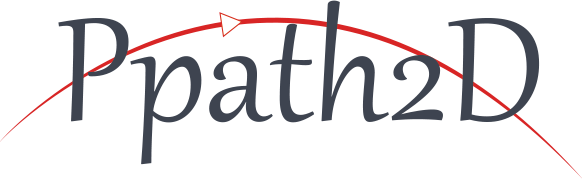

<br>
<p align="center"></p>
<br>
<p align="center">
    <a href="https://www.npmjs.com/package/ppath2d"></a>
    <a href="https://travis-ci.org/KHC-ZhiHao/Ppath2D">
    
    </a>
    <a href="https://coveralls.io/github/KHC-ZhiHao/Ppath2D?branch=master">
        
    </a>
    <a href="https://standardjs.com/">
        
    </a>
    <a href="https://github.com/KHC-ZhiHao/Packhouse"></a>
    <br>
</p>

<br>

#### 中文大綱

Ppath2D是一個javascript canvas path render 模塊

P代表position，本庫不僅能夠在cavnas 2d繪製路徑，更能取得路徑的定位與方向，發掘更多有趣的應用與效果。

[使用路徑模擬路燈底下的飛蟻](https://khc-zhihao.github.io/Ppath2D/demo/index.html)

[線上模擬工具](https://khc-zhihao.github.io/Ppath2D/demo/try.html)

>此module並未使用Path2D渲染，而是使用更底層的計算方法繪製圖形，不僅是為了降低瀏覽器支援問題，更希望能夠使用在繪圖以外的應用。
>因此如果只是單純需要渲染路徑，使用Path2D API，它快到不行。

#### English outline

Ppath2D is a javascript canvas path render module.

P represent position, This module not only render 2d path, More capable get position and directio on the path.

[Flying ants under the street lights demo.](https://khc-zhihao.github.io/Ppath2D/demo/index.html)

[Online Editor](https://khc-zhihao.github.io/Ppath2D/demo/try.html)

>This module no use Path2D API, But use basic calculation render graphics, In order to lower the problem of browser support and hope to use beside render graphic.
>So if you just need to render the path, use the Path2D API.

## 安裝 (Install)

webpack

```bash
$ npm i ppath2d
```

html

```html
<script src="https://rawcdn.githack.com/KHC-ZhiHao/Ppath2D/master/dist/index.js"></script>
```

## 快速上手 (How to use)

快速的在畫布上繪製一條斜線(Draw a line)

html:
```html
<canvas id="demo" width="800" height="600"></canvas>
<script src="./dist/index.js"></script>
```

webpack
```js
import Ppath2D from 'ppath2d'
let line = new Ppath2D()
```

javascript
```js
let canvas = document.getElementById('demo')
let context = canvas.getContext('2d')
let line = new Ppath2D()
line.moveTo(10,10).lineTo(200,200)
line.render(context)
context.stroke()
```

### 快取模式(use cache)

如果某些路徑需要大量的運算資源，這是空間換取時間的設定。

Use more memory get more fast.

```js
let line = new Ppath2D()
line.moveTo(10,10).lineTo(200,200)
line.setCache(true)
```

### 一樣的直線，使用SVG d語法 (Draw a line for d)

javascript
```js
let line = new Ppath2D('m10,10 l200,200')
line.render(context)
context.stroke()
```

Ppath2D的路徑可以轉換成d語法(Ppath2D to d string)

```js
let line = new Ppath2D()
line.moveTo(10,10).lineTo(200,200)
line.toPathString() // 'M10,10L210,210'
```

### 加入路徑 (Add Path)

可於尾端加入一條 *Ppath2D* 的路徑

```js
let line = new Ppath2D('m10,10 l200,200')
    line.addPath(new Ppath2D('m0,0 l200,200'))
```

### 若要解讀多邊形，將第二個參數傳入"polygon" (read Polygon)

javascript
```js
let line = new Ppath2D(`
    27.729,43.169 11.256,51.829 14.402,33.486 1.075,20.495 19.492,17.819 27.729,1.13 
    35.966,17.819 54.383,20.495 41.056,33.486 44.202,51.829
`, 'polygon')
line.render(context)
context.fill()
```

### 若要解讀多折線，將第二個參數傳入"polyline" (read Polyline)

javascript
```js
let line = new Ppath2D(`0.5,0.5 211.5,0.5 0.5,81.5 0.5,227.5`, 'polyline')
line.render(context)
context.stroke()
```

### 獲取定位 (Get position)

```js
let p = new Ppath2D('m10,10 l200,200')
let position = p.getLinePosition(0.5)
//getLinePosition(t) t is begin to finish (0~1)
//position.x === position.y === 110
```

#### 獲取終點 (Get Last Position)

```js
let p = new Ppath2D('m10,10 l200,200')
let position = p.getLastPosition()
//position.x === position.y === 210
```

### 獲取方向 (Get direction)

```js
let p = new Ppath2D('m10,10 l200,200')
let direction = p.getDirection(0.5)
//getDirection(t) t is begin to finish (0~1)
//direction === -225
```

## 描繪函數 (Draw path method)

你可以藉由下列的描繪函數建立你的路徑

* moveTo(x,y,absolute)
* lineTo(x,y,absolute)
* horizontalLineTo(x,absolute)
* verticalLineTo(y,absolute)
* curve(x1,y1,x2,y2,x,y,absolute)
* quadraticBezierCurve(x1,y1,x,y,absolute)
* smoothCurve(x2,y2,x,y,absolute)
* smoothQuadraticBezierCurve(x,y,absolute)
* arc(rx,ry,rotation,large,sweep,x,y,absolute)
* closePath()

## 關於Nodejs (About nodejs)

因為是純數學，所以nodejs也可以運行Ppath2D，可以藉由node-canvas畫出路徑：

Because it is pure math, nodejs can also run Ppath2D, which can be drawn by node-canvas:

```js
let { createCanvas } = require('canvas')
let fs = require('fs')
let Ppath2D = require('./src/Path.js')
let canvas = createCanvas(200, 200)
let context = canvas.getContext('2d')
let line = new Ppath2D('m0,0 l200,200')
line.render(context)
context.stroke()
let buffer = canvas.toBuffer()
fs.writeFileSync('./line.png', buffer)
```

## 參考(Reference)

[Mathematical formula](https://ericeastwood.com/blog/25/curves-and-arcs-quadratic-cubic-elliptical-svg-implementations)

[npm-image]: https://img.shields.io/npm/v/ppath2d.svg
[npm-url]: https://npmjs.org/package/ppath2d
